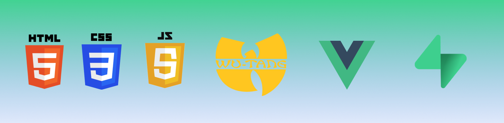

<h1>Apuntes Bootcamp </h1>
En este readme veremos un breve resumen de lo que hemos realizado cada dia en las clases del bootcamp de IronHack

## 07 Noviembre 

- Iniciación en HTML 
    - Tags meta
    - Diferentes tipos de tipografía
    - Introducir links locales y externos
    - Introducir imagenes
    - Listas

## 08 Noviembre

- Iniciación CSS
    - Colores
    - Tipografías
    - Background
    - Borders
    - Box-model

## 09 Noviembre

- CSS
    - Forms
    - Backgroung image
    - Buttons

## 10 Noviembre

- CSS
    - Media query
    - Flex box
    - Inline vs block
    - Positions

## 11 Noviembre

- JavaScript
    - First contact
- CSS
    - Grid

## 14 Noviembre 

---- JS PART ----

1. Intro de JS.
2. Sintaxis básica de JS.
   2.1. Tipos de datos en JS (Primitivos y no-Primitivos)
3. Variables JS.
   3.1. que es una variable.
   3.2. tipos de variables.
   3.2. como declarar e inicializar una variable.
   3.3. método camelCase para nombrar variables.
4. reasignar valor a variable ya declarada (no en caso de const)
5. Los operadores
   5.1. asignacion
   5.2. aritméticos
   5.3. comparación
   5.4. lógicos
6. Los condicionales
   6.1. uso del if, else ig, else


    
## 15 Noviembre

- JavaScript 
    - Methods
    - Objects
    - Arrays
    - Loops
    - Conditionals

## 16 Noviembre

- JavaScript
    - Lab JS
    - DOM

## 17 Noviembre

- JavaScript
    - Methods
    - Lab JS
    - Events

# 18 Noviembre

- JavaScript
    - Lab
    - Callback
    - Promise 
    - Async/wait


<h1 align="center">
  <a href="https://github.com/dzc1/ironhack-nov07">
    
  </a>
</h1>
  <p align="center">
  Este repositorio sirve como una guia para la clase de FE Dev - Vue Conforcat. Done estaremos apendiendo acerca de HTML, CSS3, Javascript, Vue & Supabase.
</p>
 <p align="center" style="font: 16px">
 Creado con ❤️ por Diego Zito, Carlos Garrido & Aleix Abuli.
</p>

## Link a Zoom

[Zoom Link](https://ironhack.zoom.us/j/93120423452)

## Estructura de Carpetas

- [Html Basics](https://github.com/dzc1/ironhack-nov07/tree/main/section-01-html)
  - [Basic Layout](https://github.com/dzc1/ironhack-nov07/blob/main/section-01-html/01-basic-layout.¡html)
  - [Meta Tags](https://github.com/dzc1/ironhack-nov07/blob/main/section-01-html/02-meta-tags.html)
  - [Typography, Headings, Paragraphs](https://github.com/dzc1/ironhack-nov07/blob/main/section-01-html/03-typography.html)
  - [Anchor Tags / Links](https://github.com/dzc1/ironhack-nov07/blob/main/section-01-html/04-links.html)
  - [Images](https://github.com/dzc1/ironhack-nov07/blob/main/section-01-html/05-images.html)
  - [Ordered & Unordered Lists](https://github.com/dzc1/ironhack-nov07/blob/main/section-01-html/06-list.html)
  - [Semantic & Non Semantic Elements - Layout](https://github.com/dzc1/ironhack-nov07/blob/main/section-01-html/07-layout.html)
  - [Layout Example - Basic Website Structure](https://github.com/dzc1/ironhack-nov07/blob/main/section-01-html/08-layout-example.html)
  - [Html Tables](https://github.com/dzc1/ironhack-nov07/blob/main/section-01-html/09-tables.html)
  - [HTML Forms](https://github.com/dzc1/ironhack-nov07/blob/main/section-01-html/14-forms.html)
- [Css Basics](https://github.com/dzc1/ironhack-nov07/tree/main/section-02-css)
  - [CSS Basics](https://github.com/dzc1/ironhack-nov07/blob/main/section-02-css/01-basics.html)
  - [CSS Selectors](https://github.com/dzc1/ironhack-nov07/blob/main/section-02-css/02-selectors.html)
  - [Fonts](https://github.com/dzc1/ironhack-nov07/blob/main/section-02-css/03-fonts.html)
  - [Text Properties](https://github.com/dzc1/ironhack-nov07/blob/main/section-02-css/04-text-properties.html)
  - [Colors](https://github.com/dzc1/ironhack-nov07/blob/main/section-02-css/05-colors.html)
  - [Borders & Backgrounds](https://github.com/dzc1/ironhack-nov07/blob/main/section-02-css/06-borders-background.html)
  - [Box Model](https://github.com/dzc1/ironhack-nov07/blob/main/section-02-css/07-box-model.html)
  - [Layout - Floats](https://github.com/dzc1/ironhack-nov07/blob/main/section-02-css/08-float-algin.html)
  - [Links & Buttons](https://github.com/dzc1/ironhack-nov07/blob/main/section-02-css/09-links-buttons.html)

## Chuletas

- [Markdown Cheatsheet](https://www.markdownguide.org/cheat-sheet/)
- [Git Cheatsheet](https://education.github.com/git-cheat-sheet-education.pdf)
- [Html Cheatsheet](https://devhints.io/html)
- [Css Cheatsheet](https://devhints.io/css)

## Links de Ayuda

-[CSS Links]() -[Html Links]() -[JS Links]() -[Vue Links]()

## Comandos de Git

Sigue estos pasos para hacer cambios en tu repositorio:

Para subir tus cambios al stream de git tienes que `añadir` tus cambios recientes mediante el siguiente comando:

`Añadir` todos tus cambios:

```bash
git add .
```

`Añadir` cambio individual por nombre de archivo:

```bash
git add "nombre de archivo ej: 01-bsaic-layout.html"
```

`Añadirle` un `comentario` al `commit` que estaremos empujando a tu repositorio en la web.

```bash
git commit -m "Texto descriptivo de los cambios recientes"
```

`Empujar` los cambios recientes a tu repositorio en la web. `Extended`.

```bash
git push origin "nombre del branch/rama que estaremos apuntando"
```

`Empujar` los cambios recientes a tu repositorio en la web. `Simplified`.

```bash
git push
```

Ver los `branches` asociados al repositorio.

```bash
git branch
```